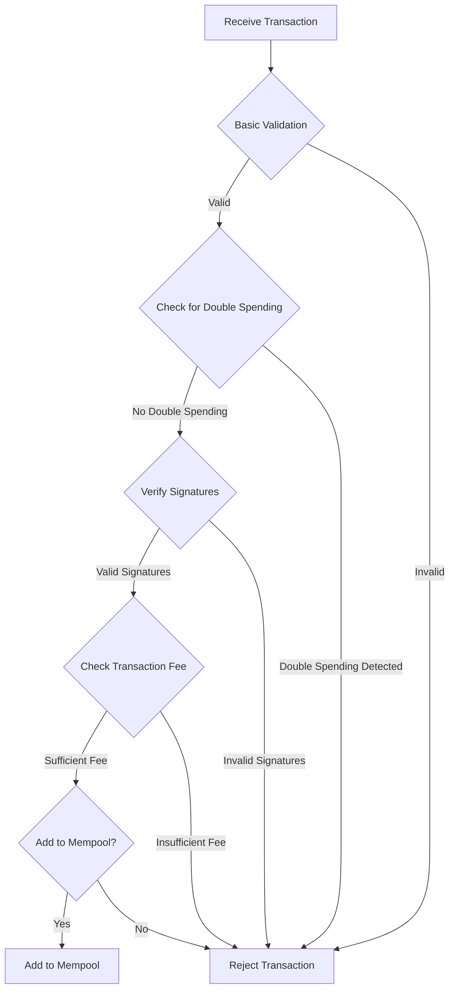
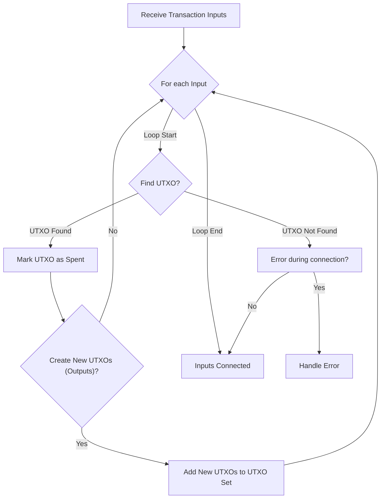
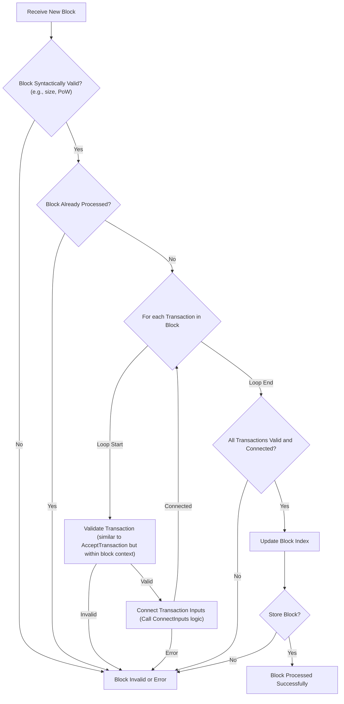

# Core Blockchain System Flowcharts

This document contains Mermaid flowcharts illustrating various core processes within a Bitcoin-like blockchain system.

## AcceptTransaction Flowchart



## ConnectInputs Flowchart



## ProcessBlock Flowchart



## AcceptBlock Flowchart

```mermaid
graph TD
    A[Validated Block Received] --> B{"Check for Orphan?"};
    B -- Orphan --> G[Block Not Accepted (e.g., orphan, failed connection)];
    B -- Not Orphan --> C{"Connect to Main Chain?"};
    C -- Yes --> D[Add to Main Chain];
    C -- No --> E{"Is it a new longest chain?"};
    E -- Yes --> F["Trigger Reorganization (Call Reorganize logic)"];
    F --> D;
    E -- No --> H[Add to Side Chain / Store as Orphan];
    H --> G;
    D --> I[Update Chain State (e.g., difficulty, height)];
    I --> J{"Broadcast Block to Peers?"};
    J -- Yes --> K[Block Accepted];
    J -- No --> K;
```

## Reorganize Flowchart

```mermaid
graph TD
    A[Reorganization Triggered (New longer chain identified)] --> B["Identify Fork Point"];
    B --> C{For Blocks on Old Chain (after fork point)};
    C -- Loop Start --> D["Disconnect Block"];
    D --> E["Revert Transactions (add back to mempool or discard)"];
    E --> F[Update UTXO Set];
    F --> C;
    C -- Loop End --> G{For Blocks on New Chain (after fork point)};
    G -- Loop Start --> H["Connect Block (similar to AcceptBlock/ProcessBlock logic for these blocks)"];
    H -- Invalid Block --> M["Reorganization Failed? (e.g. invalid block found in new chain during process)"];
    H -- Valid Block --> I["Apply Transactions"];
    I --> J[Update UTXO Set];
    J --> G;
    G -- Loop End --> K["Switch to New Chain"];
    K --> L[Update Chain Head Pointer];
    L --> N{"Broadcast New Chain Tip?"};
    N -- Yes --> O[Reorganization Complete];
    N -- No --> O;
    M -- Yes --> P[Handle Reorganization Failure];
    M -- No --> K; // Should not happen if block is invalid
```

## BitcoinMiner Flowchart

```mermaid
graph TD
    A[Start Mining] --> B["Get Latest Block Template (Coinbase transaction, select transactions from mempool)"];
    B --> C["Assemble Block Header (Version, Prev. Block Hash, Merkle Root, Time, Bits, Nonce)"];
    C --> D{Loop: Vary Nonce / ExtraNonce};
    D --> E["Hash Block Header"];
    E --> F{"Is Hash < Target?"};
    F -- No --> G{"Receive New Block from Network?"};
    G -- No --> D;
    G -- Yes --> H["Validate New Block"];
    H -- Valid --> B; // Restart with new template
    H -- Invalid --> D; // Continue mining current attempt
    F -- Yes --> I["Block Found!"];
    I --> J["Broadcast Valid Block"];
    J --> B; // Go back to get new template for next block
    A --> K[Stop Mining]; // Allow for stopping condition
```
