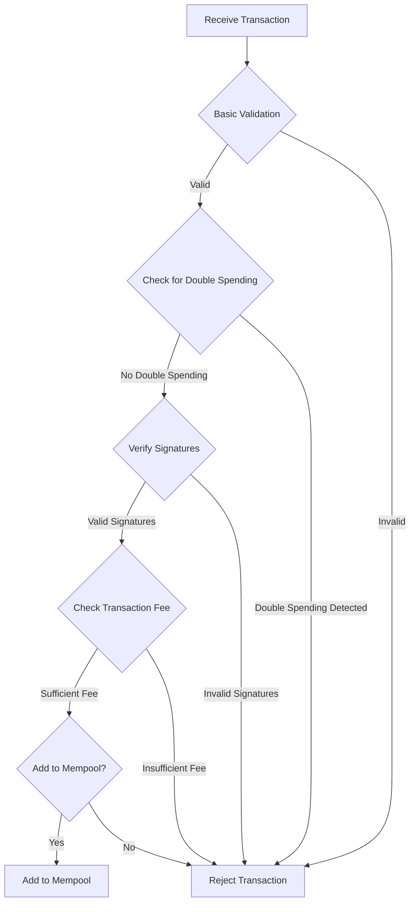

```mermaid
graph TD
    A[Receive Transaction] --> B{Basic Validation};
    B -- Valid --> C{Check for Double Spending};
    B -- Invalid --> H[Reject Transaction];
    C -- No Double Spending --> D{Verify Signatures};
    C -- Double Spending Detected --> H;
    D -- Valid Signatures --> E{Check Transaction Fee};
    D -- Invalid Signatures --> H;
    E -- Sufficient Fee --> F{"Add to Mempool?"};
    E -- Insufficient Fee --> H;
    F -- Yes --> G[Add to Mempool];
    F -- No --> H;
```
