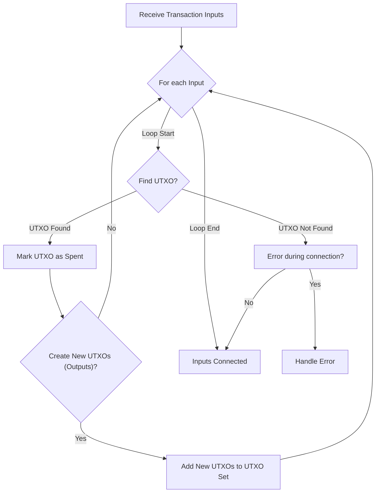

```mermaid
graph TD
    A[Receive Transaction Inputs] --> B{For each Input};
    B -- Loop Start --> C{"Find UTXO?"};
    C -- UTXO Found --> D[Mark UTXO as Spent];
    C -- UTXO Not Found --> G["Error during connection?"];
    D --> E{"Create New UTXOs (Outputs)?"};
    E -- Yes --> F[Add New UTXOs to UTXO Set];
    E -- No --> B;
    F --> B;
    B -- Loop End --> H[Inputs Connected];
    G -- Yes --> I[Handle Error];
    G -- No --> H;
```
