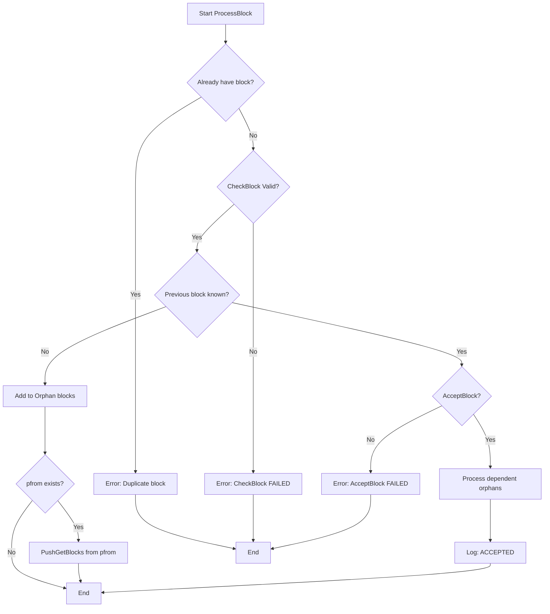
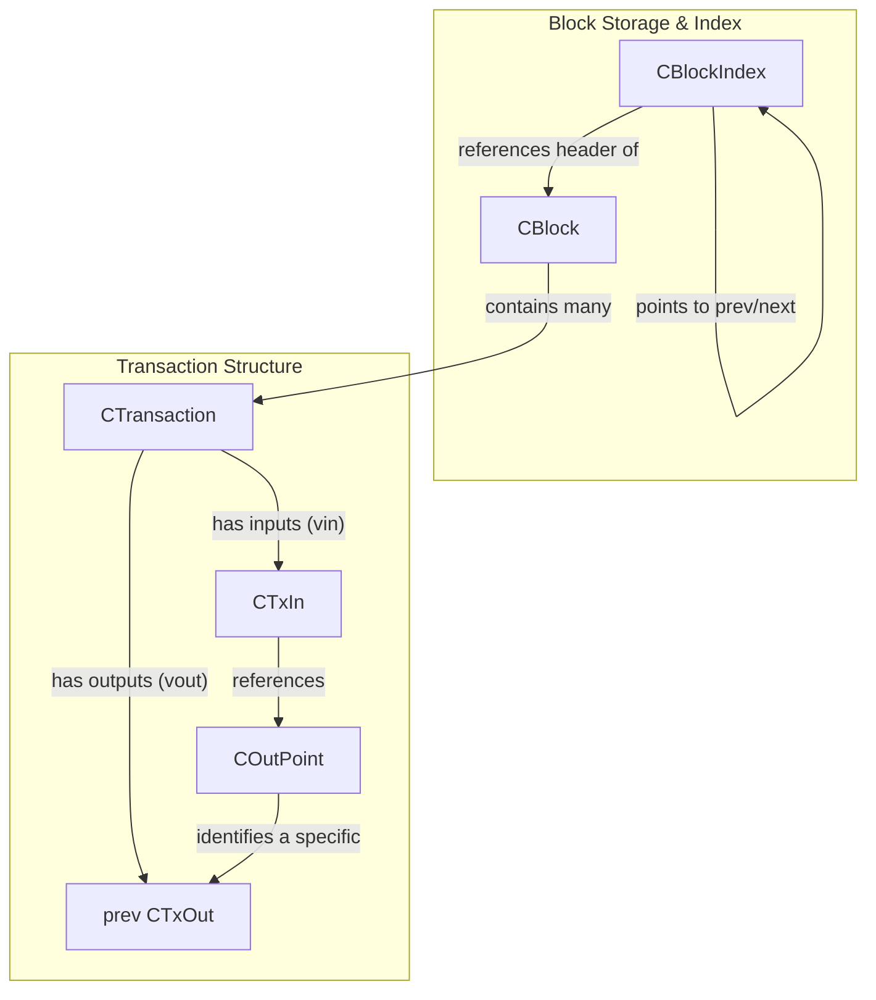

# Core Blockchain Systems

## Block Processing

The `ProcessBlock` function in `main.cpp` is responsible for handling new blocks received from the network.

```cpp
bool ProcessBlock(CNode* pfrom, CBlock* pblock)
{
    // Check for duplicate
    uint256 hash = pblock->GetHash();
    if (mapBlockIndex.count(hash))
        return error("ProcessBlock() : already have block %d %s", mapBlockIndex[hash]->nHeight, hash.ToString().substr(0,16).c_str());
    if (mapOrphanBlocks.count(hash))
        return error("ProcessBlock() : already have block (orphan) %s", hash.ToString().substr(0,16).c_str());

    // Preliminary checks
    if (!pblock->CheckBlock())
    {
        delete pblock;
        return error("ProcessBlock() : CheckBlock FAILED");
    }

    // If don't already have its previous block, shunt it off to holding area until we get it
    if (!mapBlockIndex.count(pblock->hashPrevBlock))
    {
        printf("ProcessBlock: ORPHAN BLOCK, prev=%s\n", pblock->hashPrevBlock.ToString().substr(0,16).c_str());
        mapOrphanBlocks.insert(make_pair(hash, pblock));
        mapOrphanBlocksByPrev.insert(make_pair(pblock->hashPrevBlock, pblock));

        // Ask this guy to fill in what we're missing
        if (pfrom)
            pfrom->PushGetBlocks(pindexBest, GetOrphanRoot(pblock));
        return true;
    }

    // Store to disk
    if (!pblock->AcceptBlock())
    {
        delete pblock;
        return error("ProcessBlock() : AcceptBlock FAILED");
    }
    delete pblock;

    // Recursively process any orphan blocks that depended on this one
    vector<uint256> vWorkQueue;
    vWorkQueue.push_back(hash);
    for (int i = 0; i < vWorkQueue.size(); i++)
    {
        uint256 hashPrev = vWorkQueue[i];
        for (multimap<uint256, CBlock*>::iterator mi = mapOrphanBlocksByPrev.lower_bound(hashPrev);
             mi != mapOrphanBlocksByPrev.upper_bound(hashPrev);
             ++mi)
        {
            CBlock* pblockOrphan = (*mi).second;
            if (pblockOrphan->AcceptBlock())
                vWorkQueue.push_back(pblockOrphan->GetHash());
            mapOrphanBlocks.erase(pblockOrphan->GetHash());
            delete pblockOrphan;
        }
        mapOrphanBlocksByPrev.erase(hashPrev);
    }

    printf("ProcessBlock: ACCEPTED\n");
    return true;
}
```

The logic is as follows:
1.  **Duplicate Check**: It first checks if the block (identified by its hash) is already in `mapBlockIndex` (main chain) or `mapOrphanBlocks`. If so, it's an error.
2.  **Preliminary Checks**: It calls `pblock->CheckBlock()`. This function performs context-independent checks like size limits, timestamp validity, coinbase transaction rules, individual transaction checks (`tx.CheckTransaction()`), proof-of-work, and Merkle root.
3.  **Orphan Handling**: If the previous block (`pblock->hashPrevBlock`) is not found in `mapBlockIndex`, the current block is considered an orphan. It's added to `mapOrphanBlocks` and `mapOrphanBlocksByPrev`. If the block came from a peer (`pfrom`), a request (`PushGetBlocks`) is sent to that peer to fetch the missing blocks, starting from the best known block (`pindexBest`) up to the root of this orphan chain (`GetOrphanRoot(pblock)`).
4.  **Block Acceptance**: If the previous block exists, `pblock->AcceptBlock()` is called. This function:
    *   Checks for duplicates again.
    *   Retrieves the previous block index.
    *   Checks the timestamp against the previous block's median time past.
    *   Ensures all transactions are final (for blocks after a certain height).
    *   Verifies the proof-of-work (`nBits != GetNextWorkRequired(pindexPrev)`).
    *   Writes the block to disk (`WriteToDisk`).
    *   Adds the block to the block index (`AddToBlockIndex`).
    *   If this block becomes the new best chain tip, it might trigger a relay of inventory (`RelayInventory`).
5.  **Orphan Processing (Recursive)**: After a block is successfully accepted, the code iterates through `vWorkQueue` (initially containing the hash of the current block). It looks for any orphan blocks in `mapOrphanBlocksByPrev` that listed the newly accepted block as their previous block. If such orphans are found, it attempts to accept them (`pblockOrphan->AcceptBlock()`). If successful, their hashes are added to `vWorkQueue` to process further dependent orphans. Accepted orphans are removed from `mapOrphanBlocks` and `mapOrphanBlocksByPrev`.

### Mermaid Flowchart for `ProcessBlock`



## Transaction Processing

Transaction processing logic is primarily within `CTransaction::AcceptTransaction` and the message handling part of `ProcessMessage` for the "tx" command.

```cpp
// From CTransaction class in main.cpp
bool CTransaction::AcceptTransaction(CTxDB& txdb, bool fCheckInputs, bool* pfMissingInputs)
{
    if (pfMissingInputs)
        *pfMissingInputs = false;

    // Coinbase is only valid in a block, not as a loose transaction
    if (IsCoinBase())
        return error("AcceptTransaction() : coinbase as individual tx");

    if (!CheckTransaction())
        return error("AcceptTransaction() : CheckTransaction failed");

    // To help v0.1.5 clients who would see it as negative number. please delete this later.
    if (nLockTime > INT_MAX)
        return error("AcceptTransaction() : not accepting nLockTime beyond 2038");

    // Do we already have it?
    uint256 hash = GetHash();
    CRITICAL_BLOCK(cs_mapTransactions)
        if (mapTransactions.count(hash))
            return false;
    if (fCheckInputs)
        if (txdb.ContainsTx(hash))
            return false;

    // Check for conflicts with in-memory transactions
    CTransaction* ptxOld = NULL;
    for (int i = 0; i < vin.size(); i++)
    {
        COutPoint outpoint = vin[i].prevout;
        if (mapNextTx.count(outpoint))
        {
            // Allow replacing with a newer version of the same transaction
            if (i != 0)
                return false;
            ptxOld = mapNextTx[outpoint].ptx;
            if (!IsNewerThan(*ptxOld))
                return false;
            for (int i = 0; i < vin.size(); i++)
            {
                COutPoint outpoint = vin[i].prevout;
                if (!mapNextTx.count(outpoint) || mapNextTx[outpoint].ptx != ptxOld)
                    return false;
            }
            break;
        }
    }

    // Check against previous transactions
    map<uint256, CTxIndex> mapUnused;
    int64 nFees = 0;
    if (fCheckInputs && !ConnectInputs(txdb, mapUnused, CDiskTxPos(1,1,1), 0, nFees, false, false))
    {
        if (pfMissingInputs)
            *pfMissingInputs = true;
        return error("AcceptTransaction() : ConnectInputs failed %s", hash.ToString().substr(0,6).c_str());
    }

    // Store transaction in memory
    CRITICAL_BLOCK(cs_mapTransactions)
    {
        if (ptxOld)
        {
            printf("mapTransaction.erase(%s) replacing with new version\n", ptxOld->GetHash().ToString().c_str());
            mapTransactions.erase(ptxOld->GetHash());
        }
        AddToMemoryPool();
    }

    // If updated, erase old tx from wallet
    if (ptxOld)
        EraseFromWallet(ptxOld->GetHash());

    printf("AcceptTransaction(): accepted %s\n", hash.ToString().substr(0,6).c_str());
    return true;
}

// Relevant part from ProcessMessage in main.cpp
    else if (strCommand == "tx")
    {
        vector<uint256> vWorkQueue;
        CDataStream vMsg(vRecv);
        CTransaction tx;
        vRecv >> tx;

        CInv inv(MSG_TX, tx.GetHash());
        pfrom->AddInventoryKnown(inv);

        bool fMissingInputs = false;
        if (tx.AcceptTransaction(true, &fMissingInputs)) // Calls CTransaction::AcceptTransaction
        {
            AddToWalletIfMine(tx, NULL);
            RelayMessage(inv, vMsg);
            mapAlreadyAskedFor.erase(inv);
            vWorkQueue.push_back(inv.hash);

            // Recursively process any orphan transactions that depended on this one
            // ... (orphan processing logic) ...
        }
        else if (fMissingInputs)
        {
            printf("storing orphan tx %s\n", inv.hash.ToString().substr(0,6).c_str());
            AddOrphanTx(vMsg);
        }
    }
```

The logic for `CTransaction::AcceptTransaction` is:
1.  **Coinbase Check**: Rejects if the transaction is a coinbase transaction (coinbase transactions are only valid within blocks).
2.  **Basic Validation**: Calls `CheckTransaction()` which checks for empty inputs/outputs and negative output values. For non-coinbase transactions, it ensures inputs are not null.
3.  **LockTime Check**: Rejects transactions with `nLockTime` beyond `INT_MAX` (a legacy check).
4.  **Duplicate Check**: Checks if the transaction hash already exists in `mapTransactions` (memory pool) or `txdb` (on disk if `fCheckInputs` is true).
5.  **Conflict Check (Memory Pool)**: Iterates through inputs (`vin`) to see if any `COutPoint` is already in `mapNextTx` (indicating an output spent by another mempool transaction). It allows for transaction replacement if the new transaction is "newer" (`IsNewerThan`) and spends all the same inputs as the old one.
6.  **Input Connection**: If `fCheckInputs` is true, it calls `ConnectInputs`. This crucial function:
    *   Checks if previous output transactions exist and are unspent.
    *   Verifies coinbase maturity if spending a coinbase output.
    *   Verifies signatures (`VerifySignature`).
    *   Calculates and checks transaction fees.
    *   (If `fBlock` is true, it would mark inputs as spent and add the transaction to the disk index, but for mempool acceptance, `fBlock` is false).
    *   If any inputs are missing, `pfMissingInputs` is set to true.
7.  **Memory Pool Storage**: If all checks pass:
    *   If an older transaction `ptxOld` was replaced, it's erased from `mapTransactions`.
    *   The new transaction is added to the memory pool via `AddToMemoryPool()` (which adds to `mapTransactions` and updates `mapNextTx`).
8.  **Wallet Update**: If an old transaction was replaced, it's erased from the wallet (`EraseFromWallet`).

When a "tx" message is received (`ProcessMessage`):
1.  The transaction is deserialized.
2.  `tx.AcceptTransaction(true, &fMissingInputs)` is called.
3.  If accepted:
    *   It's added to the wallet if it's mine (`AddToWalletIfMine`).
    *   The transaction is relayed to other peers (`RelayMessage`).
    *   Any orphan transactions that depended on this transaction are recursively processed.
4.  If `AcceptTransaction` fails due to missing inputs, the transaction is added to the orphan transaction pool (`AddOrphanTx`).

### Mermaid Flowchart for `CTransaction::AcceptTransaction` (Simplified)

```mermaid
graph TD
    A[Start AcceptTransaction] --> B{IsCoinBase?};
    B -- Yes --> C[Error: Coinbase as individual tx];
    B -- No --> D{CheckTransaction Valid?};
    D -- No --> E[Error: CheckTransaction failed];
    D -- Yes --> F{nLockTime > INT_MAX?};
    F -- Yes --> G[Error: nLockTime beyond 2038];
    F -- No --> H{"Already have tx? (mempool/db)"};
    H -- Yes --> I[Return False (already have)];
    H -- No --> J{Conflict with mempool tx?};
    J -- Yes --> K{Can replace existing (IsNewerThan)?};
    K -- No --> L[Return False (conflict)];
    K -- Yes --> M[ptxOld = existing_tx];
    J -- No --> N[No conflict or replacement];
    M --> N;
    N --> O{fCheckInputs?};
    O -- No --> P[Skip ConnectInputs];
    O -- Yes --> Q{ConnectInputs successful?};
    Q -- No --> R[Error: ConnectInputs failed];
    R -- pfMissingInputs=true --> S[Set pfMissingInputs];
    S --> R;
    Q -- Yes --> T[Proceed to store];
    P --> T;
    T --> U{Critical Block: cs_mapTransactions};
    U -- ptxOld is set --> V[Erase ptxOld from mapTransactions];
    V --> W[AddToMemoryPool];
    U -- ptxOld is not set --> W;
    W --> X{ptxOld is set?};
    X -- Yes --> Y[EraseFromWallet(ptxOld)];
    X -- No --> Z[Log: Accepted];
    Y --> Z;
    Z --> AA[Return True];
    C --> BB[End];
    E --> BB;
    G --> BB;
    I --> BB;
    L --> BB;
    R --> BB;
```

## Core Data Structures

Based on `main.h`:

### `CBlock`

A block in the Bitcoin blockchain.

```cpp
class CBlock
{
public:
    // header
    int nVersion;
    uint256 hashPrevBlock;
    uint256 hashMerkleRoot;
    unsigned int nTime;
    unsigned int nBits;
    unsigned int nNonce;

    // network and disk
    vector<CTransaction> vtx;

    // memory only
    mutable vector<uint256> vMerkleTree;
    // ... methods ...
};
```

*   **Header**:
    *   `nVersion`: Block version number.
    *   `hashPrevBlock`: Hash of the previous block in the chain.
    *   `hashMerkleRoot`: The root hash of the Merkle tree of transactions in this block.
    *   `nTime`: Timestamp of when the block was created.
    *   `nBits`: The compact representation of the target difficulty for this block's proof-of-work.
    *   `nNonce`: The nonce found during mining that satisfies the proof-of-work.
*   **Transactions**:
    *   `vtx`: A `std::vector` of `CTransaction` objects included in this block. The first transaction (`vtx[0]`) must be the coinbase transaction.
*   **Memory Only**:
    *   `vMerkleTree`: A mutable `std::vector` of `uint256` representing the hashes in the Merkle tree. This is typically computed on demand.

Key methods include `GetHash()` (computes the block's hash), `BuildMerkleTree()`, `WriteToDisk()`, `ReadFromDisk()`, `CheckBlock()`, `AcceptBlock()`, `ConnectBlock()`, and `DisconnectBlock()`.

### `CTransaction`

Represents a transaction, which is a transfer of Bitcoin value.

```cpp
class CTransaction
{
public:
    int nVersion;
    vector<CTxIn> vin;
    vector<CTxOut> vout;
    unsigned int nLockTime;
    // ... methods ...
};
```

*   `nVersion`: Transaction version number.
*   `vin`: A `std::vector` of `CTxIn` objects, representing the inputs to the transaction. These inputs reference previous unspent transaction outputs (UTXOs).
*   `vout`: A `std::vector` of `CTxOut` objects, representing the outputs of the transaction. These outputs create new UTXOs that can be spent by future transactions.
*   `nLockTime`: A Unix timestamp or block number specifying the earliest time or block at which this transaction can be added to the blockchain. If 0, it's included immediately.

Key methods include `GetHash()` (computes transaction hash), `IsCoinBase()`, `CheckTransaction()`, `ConnectInputs()`, `DisconnectInputs()`, and `AcceptTransaction()`.

### `CBlockIndex`

An entry in the in-memory block tree, representing a block and its position in the chain. It doesn't store the full block but rather its header and metadata.

```cpp
class CBlockIndex
{
public:
    const uint256* phashBlock; // Pointer to the block's hash (owned by mapBlockIndex)
    CBlockIndex* pprev;        // Pointer to the previous block index in this chain
    CBlockIndex* pnext;        // Pointer to the next block index in the main chain
    unsigned int nFile;        // The file number on disk where the block is stored (blkXXXX.dat)
    unsigned int nBlockPos;    // The byte offset within the block file
    int nHeight;               // Height of this block in the blockchain

    // block header (copied from CBlock for quick access)
    int nVersion;
    uint256 hashMerkleRoot;
    unsigned int nTime;
    unsigned int nBits;
    unsigned int nNonce;
    // ... methods ...
};
```
*   `phashBlock`: A pointer to the block's hash. The actual hash is stored in `mapBlockIndex`.
*   `pprev`: Pointer to the `CBlockIndex` of the previous block. This forms the chain.
*   `pnext`: Pointer to the `CBlockIndex` of the next block in the *main chain*. Can be `NULL` if this block is not part of the main chain or is the current tip.
*   `nFile`: The file number (e.g., `blk0001.dat`) where the block's data is stored.
*   `nBlockPos`: The starting position (offset) of the block data within the file.
*   `nHeight`: The height of this block in the blockchain (number of blocks since genesis).
*   **Header fields**: `nVersion`, `hashMerkleRoot`, `nTime`, `nBits`, `nNonce` are copies of the block's header fields for quick access without reading the block from disk.

Key methods include `GetBlockHash()` and `IsInMainChain()`. `CDiskBlockIndex` is a derived class used for serialization, adding `hashPrev` and `hashNext` for storage.

### Mermaid Flowchart: Relationships between `CBlock`, `CTransaction`, and `CBlockIndex`


This flowchart shows:
*   A `CBlockIndex` primarily stores header information and pointers related to a `CBlock`, but not the full block data. It links to other `CBlockIndex` objects to form the chain structure.
*   A `CBlock` contains a list (`vtx`) of `CTransaction` objects.
*   Each `CTransaction` is composed of inputs (`CTxIn`) and outputs (`CTxOut`).
*   Each `CTxIn` contains a `COutPoint` which points to a specific `CTxOut` of a *previous* transaction that is being spent.
