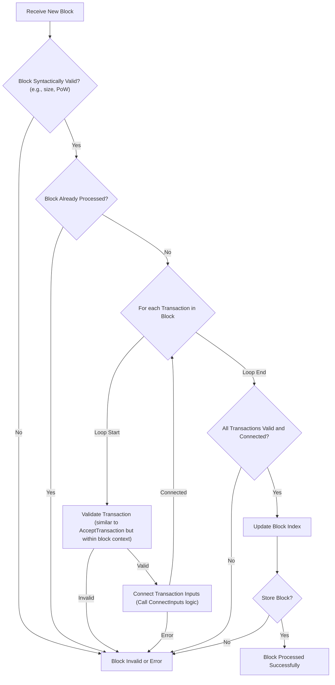

```mermaid
graph TD
    A[Receive New Block] --> B{"Block Syntactically Valid? (e.g., size, PoW)"};
    B -- No --> J[Block Invalid or Error];
    B -- Yes --> C{"Block Already Processed?"};
    C -- Yes --> J;
    C -- No --> D{For each Transaction in Block};
    D -- Loop Start --> E["Validate Transaction (similar to AcceptTransaction but within block context)"];
    E -- Invalid --> J;
    E -- Valid --> F["Connect Transaction Inputs (Call ConnectInputs logic)"];
    F -- Error --> J;
    F -- Connected --> D;
    D -- Loop End --> G{"All Transactions Valid and Connected?"};
    G -- No --> J;
    G -- Yes --> H[Update Block Index];
    H --> I{"Store Block?"};
    I -- Yes --> K[Block Processed Successfully];
    I -- No --> J;
```
